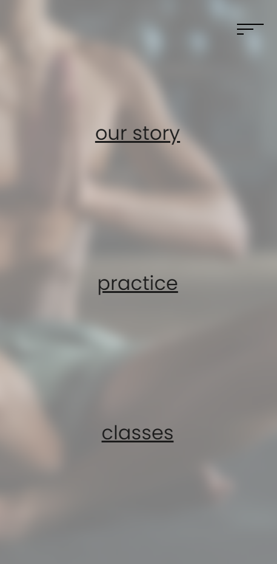
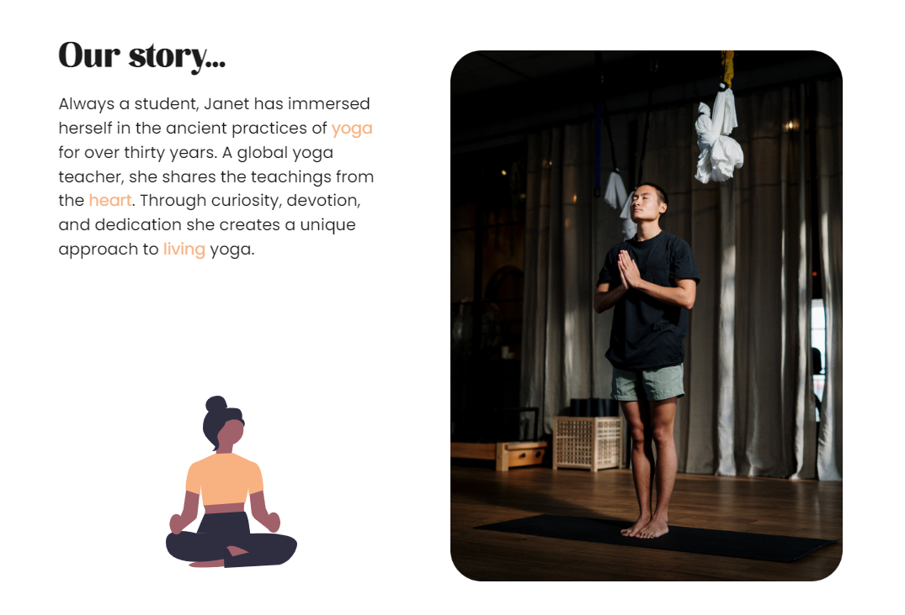

# Minimalist design :art:

## I customize a little bit this website :gift:

1. Background blur for the links page
2. Buttons hover
3. New svg in our story for large devices
4. Center three videos for larges devices
5. Add another media query with less padding
6. Change the color of some words to main color
7. The cta sec button takes you to the class videos
8. Add favicon (same as logo)

### Some images :camera_flash:

